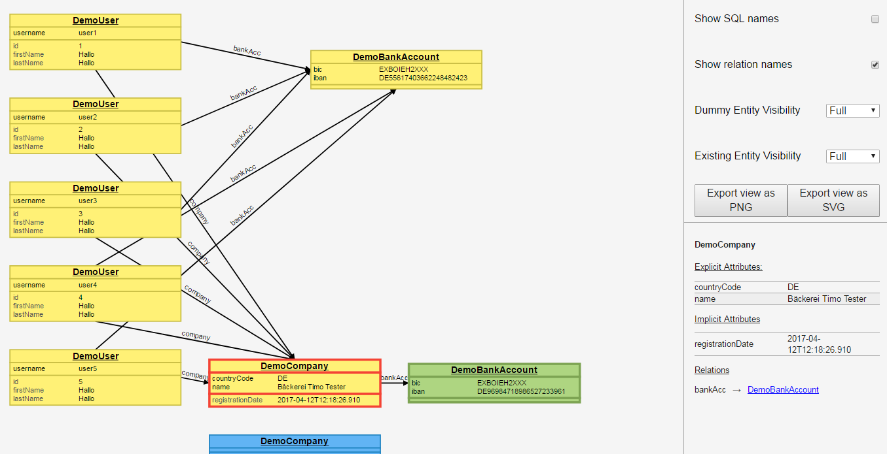

# Visualization

The [RedG Visualizer](../../visualizer/) allows you to inspect the object graph of a RedG instance.
This can be very useful for debugging purposes or to simply have a look at the dependencies of your entities.

## Preparation

!!! note
    RedG's visualization support has to be enabled during code generation time. Look at the documentation for your chosen
    [integration](../integration/index.md) method on how to enable support.
    
    Enabling visualization support will have a small performance penalty and you'll need Jackson as extra dependencies.
    
After enabling visualization support you have to add `jackson-core` and `jackson-databind` as dependencies to your test code.
These two are needed to generate the JSON output you'll need for the visualizer.

````xml
<dependency>
    <groupId>com.fasterxml.jackson.core</groupId>
    <artifactId>jackson-core</artifactId>
    <version>2.8.5</version>
    <scope>test</scope>
</dependency>
<dependency>
    <groupId>com.fasterxml.jackson.core</groupId>
    <artifactId>jackson-databind</artifactId>
    <version>2.8.5</version>
    <scope>test</scope>
</dependency>
````

Now there are two ways to obtain the entity graph as JSON code:

 * In the test, output the result of `redG.getVisualizationJson()` into a file or to the console.
 * Place a breakpoint somewhere in your test where you have access to the `redG` object, let the test run until 
 it hits the breakpoint and evaluate `redG.getVisualizationJson()` with the help of your IDE. Copy the returned string.

## Visualization

With the JSON output either in your clipboard or a file, visit 
[the RedG Visualizer site](../../visualizer/) and paste (or drag & drop) the JSON into the editor.
Hit the "Visualize Me!" button and let the visualization render.


<span class="image-caption">An example visualization</span>

### Entity view

The main panel of the visualizer shows a graphical representation of your RedG object graph. When the graph is rendered for 
the fist time a layout algorithm is applied. This results in a nice initial layout. When visualizing large object
graphs, entities may appear below or right of your initial viewport. Either zoom out or pan to see them.

| Feature | Controls |
| ------- | -------- |
| Zoom | Use your mouse wheel or double click (Pinch or double tap on touchscreens) |
| Pan / Move viewport | Click and drag on background (Cursor is default) |
| Select entity | Click an entity. Click again to deselect it |
| Move an entity | Click and drag an entity (Cursor is pointer) |

### Detail view

When you select an entity in the [entity view](#entity-view), the detail view in the lower right corner will
show all attributes (explicit & implicit) in full length and will show a list of all outgoing relations. You can
click on a relation link to directly select the referenced entity.

### Options

The upper right panel shows the available options and the export buttons.

| Option | Type | Explanation |
| ------ | ---- | ----------- |
| Show SQL names | Checkbox | If checked, the SQL table and column names will be shown instead of the Java identifiers |
| Show relation names | Checkbox | If checked, the relation arrows will show a text with the relation name |
| Dummy Entity Visibility | Combo-Box | <ul><li>Full: Show the full dummy entity (explicit & implicit fields)</li><li>Minimal: Show only the header (class / table name)</li><li>Invisible: Do not show the entity and their relations</li></ul> |
| Existing Entity Visibility | Combo-Box | <ul><li>Full: Show the full existing entity (explicit & implicit fields)</li><li>Minimal: Show only the header (class / table name)</li><li>Invisible: Do not show the entity and their relations</li></ul>
| Export view as PNG | Button | Lets you export the current viewport (exactly what you see on the left) to a PNG file. Will show a popup where you can choose the image resolution |
| Export view as SVG | Button | Lets you export the current viewport (exactly what you see on the left) to a SVG file. All information (entities & relations) are included so you could manipulate the viewport later. Used fonts might not be available on a different computer |